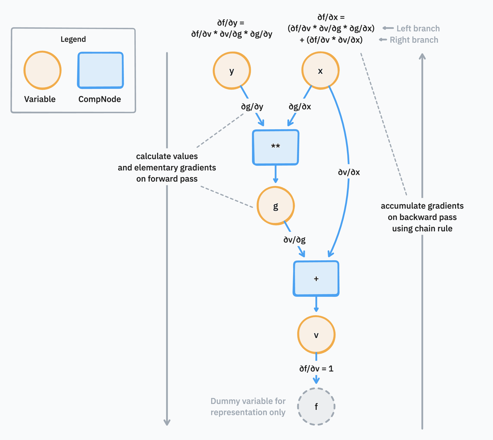

# autodiff-ts 📈

## Overview
`autodiff-ts` is a TypeScript implementation of automatic differentiation. Automatic Differentiation (AD) (TODO: add citation) is a technique for computationally determining the gradient of a function with respect to its inputs, for a certain point. It strikes a balance between the precision of symbolic differentiation and the efficiency of numerical differentiation. Differentation is a crucial part of many machine learning algorithms and optimization problems.

It provides a simple function factory `makeGradFn` that generates a gradient function for a user-provided pure function. The user-provided function can include multiple scalar outputs, arithmetic operations, and common mathematical functions and constants. The generated gradient function can be used to compute the gradient of the user-provided function at a specific point.

## Installation and Usage

```sh
npm install https://github.com/seanl01/autodiff-ts.git#public
```

```js
import { makeGradFn } from "autodiff-ts"

const f = (x, y) => y * x + x ** 2
const grad = makeGradFn(f)

```
For reference, $\frac{\partial f}{\partial x} = 2x + y$ and $\frac{\partial f}{\partial y} = x$.

```js
grad(1, 2)
// { value: 3, gradients: [4, 1] } (gradients field contains [df/dx, df/dy])

grad(3, 4)
// { value: 21, gradients: [10, 3] }
```

## Approach
- We start by first parsing the user-provided function into its abstract representation using the `acorn` library. This gives us a body expression as well as the parameters that the function accepts.
- `makeGradFn` uses the abstract expression of the original function to create the gradient function

### Reverse mode AD



1. Reverse mode AD is the default choice (over forward mode AD) for many problems, as it reduces the repeated computation needed when an expression has multiple inputs but only one output.
   - Such expressions are common in many objective functions: e.g. a loss function for a neural network
   - Rather than computing the gradient for each input variable independently, we compute the gradient of the output with respect to each input variable in a single pass.

1. We traverse the body expression of the user-provided function to build a computational graph which is an abstract representation of the function. The graph is made of
   - `Variable` nodes, which represent the input variables of the functions, as well as any intermediate inputs to any `CompNode`s
     - These are "singleton" variables. a $x$ term appearing to in different parts of the given function will be reperesented by the same `Variable` object. This will be significant during the gradient accumulation happening in the backward pass later.
   - `CompNode` nodes, which represent the computation nodes that perform arithmetic operations or mathematical functions on the input variables
     - These take in a list of `Variable`, gradient (elementary) pairs, which represent the inputs to the computation node.
     - They output a variable node, which represents the output of the computation node and a possible input to another computation node.
     - We bind two functions to each `CompNode`:
       - `computeFn`: which evaluates the computation node given the input values
       - `gradFn`: which returns the elementary gradient of the output variable with respect to the input variables
   - As we evaluate the expresssion left-to-right, we also store the topological order of the nodes.

1. We perform a forward pass to evaluate the function given new input values
   - We use the topological order of the nodes to ensure we evaluate the nodes in the correct order.
   - We use the computeFns at the ComputeNodes to evaluate the output nodes using the given inputs.
   - We use the gradFn to calculate the elementary gradient given the inputs for each ComputeNode, storing the values as "edges" between the input `Variable`s and the `ComputeNode`.

1. Instead of accumulating the gradient on the forward pass using the chain rule, we accumulate the gradient on the backward pass.
    - This requires setting the initial gradient (`gradientAcc`) as the output variable w.r.t to itself which is 1
    - We then use the chain rule to accumulate the gradient backward (See diagram), multiplying the gradient of the edge with the current gradientAcc. storing the accumulated gradient at the `Variable` nodes.
    ```ts
      inputVariable.gradientAcc += node.gradientAcc * grad // accumulate gradients backward
    ```

    - Accumulating on a variable which already has a gradientAcc involves adding the new contribution to the current gradientAcc. This is to account for the multiple "branches" that this input variable takes on. This applies the generalised chain rule. [^1]

1. We return the final output value in the form `{ value, gradients }`

### Forward mode AD (deprecated/unstable)
> This forward mode AD implementation has many limitations (see below), and reverse mode AD should be used for its better efficiency.

1. We keep a `Table`, with each entry a value-gradient pair, bound to a key
1. We add the passed in arguments into our table under their parameter names e.g. "x" or "y"
1. We set the first input variable $x$'s gradient to 1, and the remaining to 0, so that we can calculate the output value's gradient w.r.t $x$
    - We perform a left-to-right evaluation of the function body expression.
    - As we evaluate each body node, we add its value to the table, keyed by a numeric counter variable
    - We calculate the gradient of the evaluated node w.r.t $x$. We use the appropriate derivative rules to compute the result of binary arithmetic expressions as well as math functions.
    - We apply the chain rule to accumulate the gradient
    - We perform this until the entire expression is evaluated and we are left with the gradient of the final output w.r.t $x$
    - We append the gradient result to an array. We also store the final value.
1. We repeat the process for every input variable


## Limitations
- Currently it only supports functions that accept scalars and not vectors
- Currently no memoisation on the primals calculated is being done. i.e. every time we are calculating the final output gradient w.r.t. to another input variable, we end up calculating the node values again. These optimisations are central to the appeal of automatic differentiation.

[^1]: In essence, the [Generalised chain rule for multiple variables](https://en.m.wikipedia.org/wiki/Chain_rule#Multivariable_case) tells us: if output $L$ depends on functions $u(t)$ and $z(t)$, which depend on $t$, then $$\frac{\partial L}{\partial t} = \frac{\partial L}{\partial u} * \frac{\partial u}{\partial t} + \frac{\partial L}{\partial z} * \frac{\partial z}{\partial t}$$
